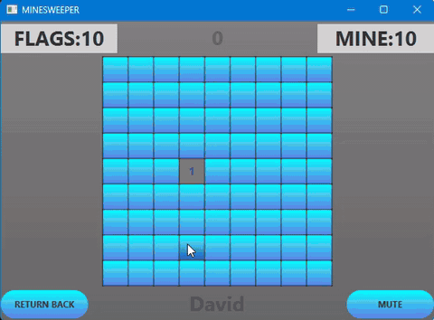

# Minesweeper

[](https://github.com/davidcohenDC/minesweeper-javafx/actions/workflows/build.yml)
[](https://github.com/davidcohenDC/minesweeper-javafx/releases/latest)
[](LICENSE)

A desktop Minesweeper in Java and JavaFX. We built it in a team of four as the
final project of the Object-Oriented Programming course at the University of
Bologna (2019/2020).

It was my first real software project, and I keep it here exactly as we handed
it in.

<p align="center">
  
</p>

## What it does

- Three modes: **Standard**, **1 vs 1** on the same board, and **Beat the Timer**.
- Easy / Medium / Hard, or a custom grid with your own size and number of mines.
- Scoreboard and statistics saved between games.
- Themes: colour schemes, mine and flag icons, background music — you can even
  drop in your own images and `.wav` files from the settings screen.

## Play it

Download `minesweeper-<version>.jar` from the
[latest release](https://github.com/davidcohenDC/minesweeper-javafx/releases/latest)
and run it with Java 17 or newer:

```sh
java -jar minesweeper-1.0.0.jar
```

JavaFX is bundled for Windows, macOS and Linux, nothing else to install.
The game keeps its settings and scores in `~/.minesweeper/`; delete that
folder to start from scratch.

Left-click opens a tile, right-click places a flag, open every safe tile to win.

## Build it

```sh
git clone https://github.com/davidcohenDC/minesweeper-javafx.git
cd minesweeper-javafx
./gradlew run      # start the game
./gradlew build    # run the tests and produce build/libs/minesweeper-<version>-all.jar
```

Any JDK from 17 to 24 is enough to run the build: the Gradle wrapper fetches
Gradle 8.14 and a Java 21 toolchain by itself. (Gradle 8.14 cannot run on
JDKs newer than 24 — if you are reading this from the future, use an older one.)

## How it is organised

Model, view and controllers are separate packages; every component has an
interface and an `*Impl` class — the way the course taught it.

- `gamelogics`, `timer`, `scoresystem` — the model: board, mines, game engine,
  timers, players and scores.
- `controllers`, `controlutility` — the menu screens and settings.
- `graphics`, `graphicsutility` — the game board itself: tiles, single-player
  and 1-vs-1 controllers, sounds, dialogs. **This was my part.**
- `src/main/resources` — FXML layouts, CSS themes, images and sounds.

Unit tests (JUnit 5) cover the model, the timer, the score system and settings I/O.

## The team

David Cohen (game board UI), Maria Mengozzi (menus and settings),
Lorenzo Morelli (game model), Luigi Olivieri (scores and timer).

## Since 2020

The Java code is untouched. In 2026 I moved the repository here from Bitbucket,
swapped the dead build setup (Gradle 5, jcenter, JavaFX 13) for a current one
and added CI and a release, so that it still builds and runs from a fresh clone.

## License

[MIT](LICENSE) © 2020 David Cohen, Maria Mengozzi, Lorenzo Morelli, Luigi Olivieri
